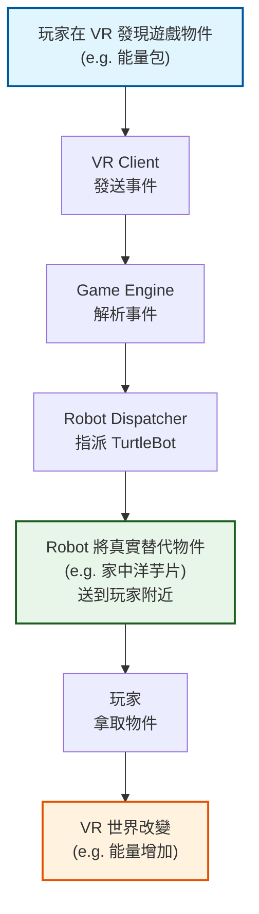
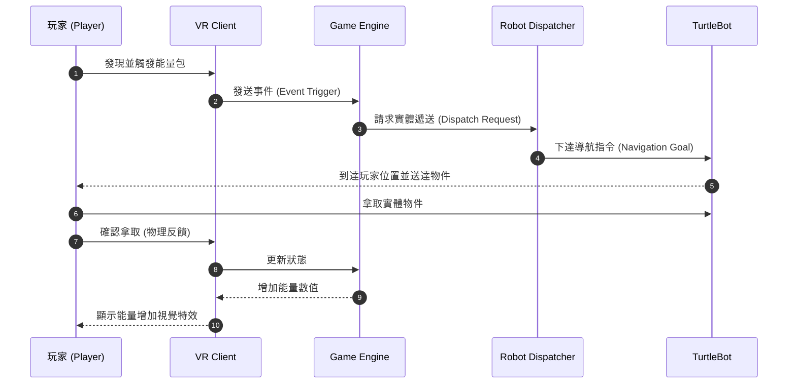
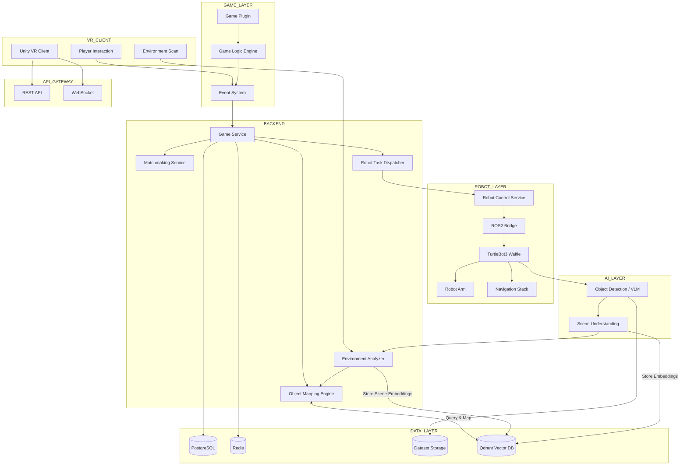
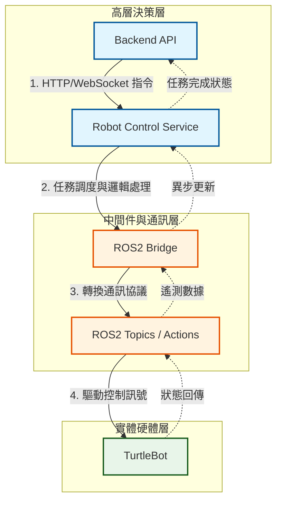
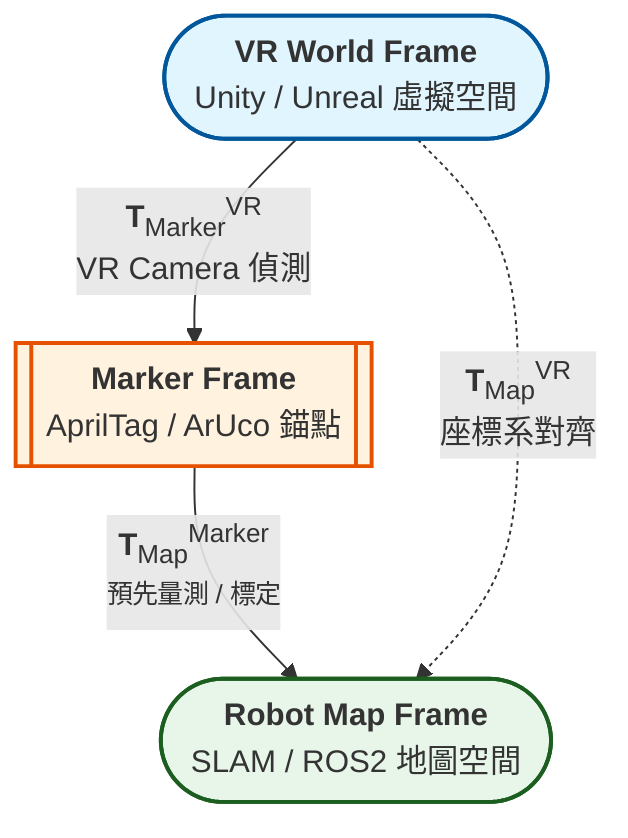

# SSD Version 0.0  
# RoboQuest VR — Mixed Reality Robotics Game Platform

---

# 系統目標與使用情境

## 系統目標

RoboQuest VR 是一個 **Mixed Reality Robotics Platform**，其核心目標是建立一個平台，使 **VR 遊戲能與實體機器人與真實物件互動**。
平台將提供：
- VR 與真實世界座標同步
- 機器人導航與互動控制
- 真實物件與 VR 物件的映射
- 多玩家連線與配對
- AI 感知與資料蒐集
- 遊戲插件化整合

此平台 **不是單一遊戲**，而是一個 **可讓多個 VR 遊戲接入的 Mixed Reality Infrastructure**。

---

## 使用情境

### 情境1：VR 探索與物件收集

玩家在 VR 世界中探索。

流程：




---

### 情境2：環境自適應遊戲

系統掃描玩家環境：
room_size: 3m x 3m
objects: ball, cube, bottle

平台會生成對應 VR 物件：

| 真實物件 | VR 物件 |
|---------|---------|
| ball | energy_pack |
| cube | gem |
| bottle | potion |

---

### 情境3：Robot NPC

TurtleBot 可在 VR 中扮演角色：

| 角色 | 功能 |
|----|----|
| Companion | 提供提示 |
| Merchant | 交換物品 |
| Boss | 阻擋玩家 |
| Supply robot | 補給 |

---

### 情境4：多玩家合作

玩家在不同空間：
- Player A (home)
- Player B (lab)
- Player C (dorm)


系統會根據：
- room size
- available objects
- robot capability

進行 **智能配對**。

---

# 完整 System Architecture

## 系統總覽



1. 控制流<br>
Player Action<br>
      ↓<br>
VR Client<br>
      ↓<br>
API Gateway<br>
      ↓<br>
Game Logic Engine<br>
      ↓<br>
Object Mapping Engine (Query Qdrant)<br>
      ↓<br>
Robot Task Dispatcher<br>
      ↓<br>
Robot Control Service<br>
      ↓<br>
Robot Action<br><br><br>

2. 資料流<br>
Robot Camera (Stereo Video)<br>
      ↓<br>
Vision Model (VLM & Depth Compute)<br>
      ↓<br>
Scene Understanding<br>
      ↓<br>
Environment Analyzer<br>
      ↓<br>
Qdrant Vector DB (Store Spatial & Object Embeddings)<br>
      ↓<br>
Game Logic / Game Plugin (Create VR Counterparts)<br><br><br>


## 系統細部設計
### (1) ROS + Backend Communication Design

Backend 與 Robot 系統透過 Robot Control Service + ROS2 Bridge 溝通。

架構：


### (2) VR ↔ Robot Coordinate Alignment 方法

Mixed Reality 需要對齊三個座標系：

1. Alignment 方法
	- 使用 AprilTag / ArUco marker。
	- 步驟：
		1. 在場地放置 marker
		2. VR camera 偵測 marker
		3. 計算 transform
		4. 對齊 VR world 與 robot map

2. Transformation
	- T_vr_marker
	- T_marker_robot
	- T_vr_robot = T_vr_marker × T_marker_robot

3. Object Synchronization<br>
VR object position<br>
       ↓<br>
Transform to robot frame<br>
       ↓<br>
Robot deliver object<br><br><br>

### (3) Game Integration Architecture（遊戲接入設計）

為了讓平台支持多種遊戲，系統採用 Game Plugin Architecture。
1. Game Abstraction Layer:<br>
Game Plugin<br>
      ↓<br>
Game Interface<br>
      ↓<br>
Mixed Reality Platform<br><br>

2. Game Plugin Structure<br>
```
games/
   energy_quest/
        rules.yaml
        objects.json
        events.py

   puzzle_game/
        rules.yaml
        objects.json
```
<br>
3. Game Event Interface:<br>
遊戲透過事件與平台互動。

Example：
```
JSON
{
  "event": "spawn_item",
  "item_type": "energy_pack",
  "vr_position": [1.2, 3.1]
}
```
平台會：
	1. 轉換 VR 座標
	2. mapping 真實物件
	3. dispatch robot


4. Object Mapping:<br>
VLM 可根據實際場景來進行Object Mapping，以下為例子:

| VR 虛擬物件 (VR Object)   | 預期觸感 (Tactile Feedback)  | 建議實體物件 (Real Object)  | 映射邏輯 (VLM Prompt) |
| ------- | --------------- | ------------------- | ------------------- | 
| 能量包 (Energy Pack) | 柔軟、有彈性、好抓取 | 軟式網球 (Soft Ball)| "Find a spherical object with low stiffness"  |
| 寶石 (Gem) | 堅硬、冷感、邊緣銳利   | 壓克力或木製方塊 (Cube) | "Find a small, transparent or hard cubic object"  |
| 炸彈 (Bomb) | 輕盈、粗糙、具有顆粒感      | 保麗龍或泡棉塊 (Foam Block) | "Identify a lightweight, high-friction block"  |
| 藥水瓶 (Potion Bottle)| 平滑、圓潤、具重量感  | 塑膠瓶 (Plastic Bottle) | "Identify a smooth, cylindrical, or contoured container"  |
		
---
# 資料 Pipeline 設計

系統會蒐集：
| Data               | Source     |
| ------------------ | ---------- |
| VR movement        | VR headset |
| object interaction | Unity      |
| robot telemetry    | ROS        |
| environment scan   | camera     |

## Pipeline
Raw Data<br>
   ↓<br>
Cleaning<br>
   ↓<br>
Dataset Storage<br>
   ↓<br>
Model Training<br>
   ↓<br>
Inference Service<br>

## Dataset Storage
```
datasets/
   vr_sessions/
   robot_logs/
   environment_scan/
```

## AI Models
| Model            | Use  |
| ---------------- | ---- |
| object detection | 環境物件 |
| pose estimation  | 玩家動作 |
| behavior model   | 玩家行為 |
---
# 功能模組切分
## API Layer

功能：
- REST API
- WebSocket
- authentication

技術：FastAPI、JWT

## Backend Layer
服務：Game Service、Matchmaking、Environment Analyzer、Object Mapping、Robot Dispatcher
技術：Celery、Redis

## UI Layer
VR 前端：Unity VR、OpenXR、Multiplayer Sync

## Data Pipeline
功能：Data ingestion、Cleaning、Dataset building、Training

## Agent Layer
AI agents：Game Master Agent、Robot Behavior Agent、Matchmaking Agent

---
#Orchestration 角色設計
系統複雜度來自：
| 面向    | 說明                 |
| ----- | ------------------ |
| 多領域整合 | VR + robotics + AI |
| 分散式架構 | 多服務                |
| 即時系統  | robot interaction  |
| 自適應遊戲 | environment-aware  |

為管理複雜 AI workflow，系統採用 agent orchestration。
Agent 協作流程:
Planner<br>
   ↓<br>
Coder<br>
   ↓<br>
Tool Runner<br>
   ↓<br>
Reviewer

- Planner：分析任務、生成執行計畫
- Coder：生成程式碼、實作功能
- Reviewer：程式碼審查、測試驗證
- Tool Runner：呼叫工具、執行 script、運行模型
  
---
# 預期 Roo Code 要如何拆解任務與協作
Roo Code 可將系統拆為：
- Task 1: System architecture
- Task 2: Backend API
- Task 3: Robot integration
- Task 4: VR client
- Task 5: AI pipeline
---
# Roo Code System Build Prompt Plan
| 執行順序 | 子任務類別           | Orchestration 角色設計  | Orchestration / Agent / Tool 模式  | 自行規劃工具使用                           | Prompt                                                                                                                                                                                                                                                                                                                                                                                                                                                                                                                                                                                                                                                                                                                                                                                                                                                                                                                                                                                                        |
| ---- | --------------- | ------------------- | -------------------------------- | ---------------------------------- | ------------------------------------------------------------------------------------------------------------------------------------------------------------------------------------------------------------------------------------------------------------------------------------------------------------------------------------------------------------------------------------------------------------------------------------------------------------------------------------------------------------------------------------------------------------------------------------------------------------------------------------------------------------------------------------------------------------------------------------------------------------------------------------------------------------------------------------------------------------------------------------------------------------------------------------------------------------------------------------------------------------- |
| 1    | 初始系統啟動          | Planner             | Planning Agent                   | architecture tools / repo analysis | **#初始系統啟動 Prompt**<br><br>You are the **System Architect Agent** responsible for bootstrapping a complex robotics mixed-reality platform.<br><br>The project is a **VR + TurtleBot Mixed Reality Platform** with the following requirements:<br>- VR clients interact with physical robots<br>- Backend service coordinates robots and games<br>- ROS2 manages robot control<br>- Coordinate alignment between VR world and robot map<br>- Plugin architecture for games<br>- Data pipeline for environment sensing and robot telemetry<br><br>Your tasks:<br><br>1. Break the system into major subsystems<br>2. Define architecture layers<br>3. Identify services and modules<br>4. Determine system dependencies<br>5. Evaluate system constraints. Define the boundary between Cloud computing (Backend) and Edge computing (TurtleBot). Design for network partition tolerance.<br>6. Generate a development roadmap<br><br>Output:<br>- System architecture overview<br>- Component dependency graph<br>- Development stages<br><br>Important:<br>- Do NOT generate code yet<br>- Focus on architecture planning<br>- Clearly list tasks that later agents will execute  |
| 2    | Orchestration規劃 | Planner             | Multi-Agent orchestration design | workflow planning tools            | **#Orchestration 規劃 Prompt**<br><br>You are an **Orchestration Planner Agent**.<br><br>Your task is to design a multi-agent workflow for implementing the VR + TurtleBot mixed reality platform.<br><br>Agents that must exist:<br>- Planner<br>- Coder<br>- Reviewer<br>- Tool Runner<br><br>Your task:<br><br>1. Break the project into executable tasks<br>2. Determine task dependencies<br>3. Assign tasks to agents<br>4. Define checkpoints between stages<br>5. Define validation conditions before proceeding to next stage (e.g., all code must pass pytest and ruff linting before moving to the next stage).<br><br>Output:<br>- Task DAG<br>- Agent responsibility mapping<br>- Execution order<br>- Checkpoint validation rules                                                                                                                                                                                                                                                                                                                                                     |
| 3    | 系統模組拆解          | Planner → Coder     | hierarchical task decomposition  | repo generation tools              | **#要 Roo Code 拆模組的 Prompt**<br><br>You are now the **System Decomposition Agent**.<br><br>The architecture includes:<br>- VR Client (Unity/OpenXR)<br>- Backend Services<br>- Robot Control Layer (ROS2)<br>- Game Plugin System<br>- Data Pipeline<br><br>Your task:<br><br>1. Break the system into modules<br>2. Define clear module boundaries<br>3. Define APIs between modules<br>4. Define repository structure<br><br>Expected modules:<br>- API Gateway<br>- Game Service<br>- Robot Dispatcher<br>- ROS Bridge<br>- Environment Analyzer<br>- Object Mapping Engine<br>- Data Pipeline<br><br>Output:<br>- Module architecture<br>- Repository directory tree<br>- Interface definitions                                                                                                                                                                                                                                                                                                            |
| 4    | Backend系統生成     | Coder               | implementation agent             | code generation tools              | Write the backend skeleton for the platform.<br><br>Requirements:<br>- Use **FastAPI** for APIs<br>- WebSocket support for VR events<br>- Robot dispatch API<br>- Game event API<br><br>Before coding:<br>1. Plan the service structure<br>2. Identify core classes<br>3. Define API schemas<br><br>After coding:<br>- Verify module dependencies<br>- Ensure code structure follows architecture plan<br><br>Crucial: Implement retry logic and timeout handling for all WebSocket and Robot API calls. Handle network disconnects gracefully.                                                                                                                                                                                                                                                                                                                                                                                                                                                                                                                                                                                                        |
| 5    | 資料庫與向量層       | Coder | implementation agent        | db schema tools                  | Integrate Qdrant for object mapping memory. Write CRUD schemas for environment snapshots so the VLM doesn't process the same object twice.                                                                                                                                                                                                                                                                                                                                                                                                                                                                                                                                                                                                                                                                                                                                                                                                                                                                                                                      | 
| 6    | Robot整合         | Coder → Tool Runner | robotics integration workflow    | ROS tools / build tools            | Implement the **robot control integration layer**.<br><br>System context:<br>- Robots are TurtleBot3<br>- ROS2 navigation stack<br>- Backend communicates via ROS bridge<br><br>Your tasks:<br><br>1. Define ROS topics<br>2. Implement ROS bridge service<br>3. Map backend commands to ROS actions<br><br>Validation:<br>- Simulated robot command flow                                                                                                                                                                                                                                                                                                                                                                                                                                                                                                                                                                                                                                                     |
| 7    | VR整合            | Coder               | integration agent                | Unity / networking tools           | Implement VR client communication layer.<br><br>Requirements:<br>- WebSocket connection to backend<br>- Event messaging system<br>- VR object synchronization<br><br>Steps:<br>1. Define VR event schema<br>2. Implement networking layer<br>3. Implement coordinate transform integration                                                                                                                                                                                                                                                                                                                                                                                                                                                                                                                                                                                                                                                                                                                    |
| 8    | AI 與 VLM 整合    | Coder               | integration agent                | vision models                    | Implement Object Mapping using VLM prompts. Translate "tactile feedback" requirements into visual search criteria. Store and retrieve embeddings from Qdrant.                                                                                                                                                                                                                                                                                                                                                                                                                                                                                                                                                                                                                                                                                                                                                                                                                                                                           |
| 9    | Data Pipeline   | Coder               | data engineering agent           | storage tools                      | Build the system data pipeline.<br><br>Data sources:<br>- VR events<br>- robot telemetry<br>- environment scans<br><br>Pipeline stages:<br>- ingestion<br>- cleaning<br>- dataset storage<br>- training integration                                                                                                                                                                                                                                                                                                                                                                                                                                                                                                                                                                                                                                                                                                                                                                                           |
| 10    | 自動檢查與Refactor   | Reviewer            | code quality agent               | lint / test tools (e.g. ruff, pytest)                 | **#要 Roo Code 自主檢查、Refactor、測試的 Prompt**<br><br>You are a **Code Reviewer Agent**.<br><br>Your task is to evaluate the entire system implementation.<br><br>Steps:<br><br>1. Analyze architecture consistency<br>2. Detect code smells<br>3. Identify missing tests<br>4. Suggest refactors<br><br>After review:<br>- produce improvement list<br>- refactor modules if necessary                                                                                                                                                                                                                                                                                                                                                                                                                                                                                                                                                                                                                             |
| 11    | 測試生成            | Tool Runner         | automated test execution         | testing tools (CI tools)                      | Generate integration tests for:<br><br>- API endpoints<br>- robot command flow<br>- VR event processing<br><br>Then execute tests and report failures.<br><br> (e.g., mocking Unity events -> checking expected ROS2 /goal_pose topics).                                                                                                                                                                                                                                                                                                                                                                                                                                                                                                                                                                                                                                                                                                                                                                                                                                                        |
| 12   | 修正方向Prompt      | Planner → Reviewer  | feedback loop                    | analysis tools                     | **#用來修正方向或錯誤的 Prompt**<br><br>The system implementation may deviate from the architecture.<br><br>Analyze the current system state and determine whether:<br>- architecture violations exist<br>- modules are missing<br>- interfaces are inconsistent<br><br>If problems exist:<br>1. propose corrections<br>2. generate refactor tasks<br>3. update development roadmap                                                                                                                                                                                                                                                                                                                                                                                                                                                                                                                                                                                                                                     |
