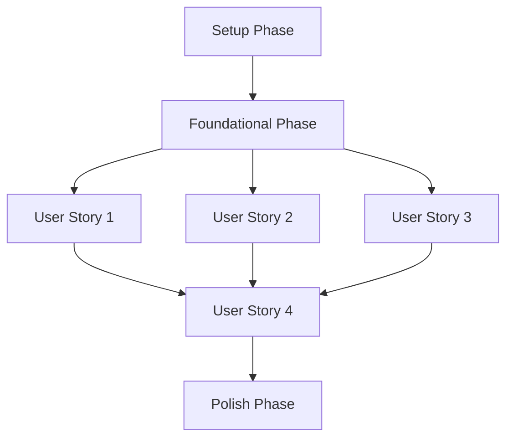

---

description: "Task list for FastAPI Backend + XR Integration Platform"
---

# Tasks: FastAPI Backend + XR Integration Platform

**Input**: Design documents from `/specs/001-fastapi-backend-plan/`
**Prerequisites**: plan.md (present), research.md (present), spec.md (missing), data-model.md (present), contracts/ (present), quickstart.md (present)

**Assumptions**:
- `/specs/001-fastapi-backend-plan/spec.md` remains missing; US1–US4 priorities and scope are inferred from [`plans/system-spec-plan.md`](plans/system-spec-plan.md:1), [`specs/001-fastapi-backend-plan/plan.md`](specs/001-fastapi-backend-plan/plan.md:1), and [`specs/001-fastapi-backend-plan/research.md`](specs/001-fastapi-backend-plan/research.md:1).
- Contracts, data model, and quickstart define the canonical interfaces referenced below.

**Tests**: TDD is mandatory. Each user story includes explicit pytest unit/integration suites and ROS2/Gazebo commands that must be written first (failing) before implementation.

**Organization**: Tasks remain grouped by phase (Setup → Foundational → US1–US4 → Polish) to keep stories independently deliverable.

## Phase 1: Setup (Shared Infrastructure)

**Purpose**: Project initialization and design artifacts required to drive implementation.

- [ ] T001 Update consolidated entity definitions for PlayerSession, EnvironmentScan, DispatchTask, RobotState, SceneEmbedding, and DatasetArtifact in specs/001-fastapi-backend-plan/data-model.md
- [ ] T002 Create API gateway contract describing REST/WebSocket schemas in specs/001-fastapi-backend-plan/contracts/api-gateway.md
- [ ] T003 Create backend services contract describing mapping/dispatcher payloads in specs/001-fastapi-backend-plan/contracts/backend-services.md
- [ ] T004 Create data layer contract covering Postgres/Redis/Qdrant/MinIO rules in specs/001-fastapi-backend-plan/contracts/data-layer.md
- [ ] T005 Create robot layer (ROS2) contract for topics/actions/QoS in specs/001-fastapi-backend-plan/contracts/robot-layer.md
- [ ] T006 Create VR/game contract for simulator payloads and coordinate transforms in specs/001-fastapi-backend-plan/contracts/vr-game.md
- [ ] T007 Build environment setup + canonical commands in specs/001-fastapi-backend-plan/quickstart.md
- [ ] T008 [P] Initialize FastAPI entrypoint shell in backend/api_gateway/app/main.py
- [ ] T009 [P] Add configuration package stub in backend/common/config/__init__.py
- [ ] T010 [P] Add telemetry package stub in backend/common/telemetry/__init__.py
- [ ] T011 [P] Add clients package stub in backend/common/clients/__init__.py
- [ ] T012 [P] Create ROS2 bridge package scaffold in robotics/ros2_bridge/__init__.py
- [ ] T013 [P] Create VR simulator scaffold in vr-client/simulator/__init__.py
- [ ] T014 [P] Ensure base unit test folder exists in tests/unit/.gitkeep

---

## Phase 2: Foundational (Blocking Prerequisites)

**Purpose**: Core infrastructure that MUST be complete before ANY user story can be implemented.

- [ ] T015 Implement environment config loader in backend/common/config/settings.py
- [ ] T016 [P] Implement JWT auth utilities in backend/common/security/jwt.py
- [ ] T017 [P] Implement rate limiting middleware in backend/api_gateway/app/middleware/rate_limit.py
- [ ] T018 Implement shared exception handlers in backend/api_gateway/app/middleware/errors.py
- [ ] T019 Implement OpenTelemetry setup in backend/common/telemetry/otel.py
- [ ] T020 Implement Postgres engine/session factory in backend/data_layer/db/session.py
- [ ] T021 [P] Implement Redis client wrapper in backend/common/clients/redis_client.py
- [ ] T022 [P] Implement Qdrant client wrapper in backend/common/clients/qdrant_client.py
- [ ] T023 [P] Implement MinIO client wrapper in backend/common/clients/minio_client.py
- [ ] T024 Create base SQLAlchemy models in backend/data_layer/models/base.py
- [ ] T025 [P] Add PlayerSession model in backend/data_layer/models/player_session.py
- [ ] T026 [P] Add EnvironmentScan model in backend/data_layer/models/environment_scan.py
- [ ] T027 [P] Add DispatchTask model in backend/data_layer/models/dispatch_task.py
- [ ] T028 [P] Add RobotState model in backend/data_layer/models/robot_state.py
- [ ] T029 [P] Add SceneEmbedding model in backend/data_layer/models/scene_embedding.py
- [ ] T030 [P] Add DatasetArtifact model in backend/data_layer/models/dataset_artifact.py
- [ ] T031 Implement repository base in backend/data_layer/repositories/base.py
- [ ] T032 [P] Implement PlayerSession repository in backend/data_layer/repositories/player_sessions.py
- [ ] T033 [P] Implement EnvironmentScan repository in backend/data_layer/repositories/environment_scans.py
- [ ] T034 [P] Implement DispatchTask repository in backend/data_layer/repositories/dispatch_tasks.py
- [ ] T035 Implement ROS2 bridge configuration in robotics/ros2_bridge/config.py
- [ ] T036 Implement VR simulator event schema loader in vr-client/simulator/event_schema.py

**Checkpoint**: Foundation ready - user story implementation can now begin in parallel.

---

## Phase 3: VR Session Ingestion & Gateway Handshake (Priority: P1) 🎯 MVP

**Goal**: Ingest VR sessions/scans/events via REST/WebSocket, enforce JWT/rate limits, persist sessions, and acknowledge within SLA.

**Independent Test**: Run VR simulator to send a session + scan; verify ACK <150 ms and session persisted in Postgres/Redis with trace IDs.

### Tests for User Story 1 (TDD-first)

- [ ] T037 [P] [US1] Write failing FastAPI REST/WebSocket contract tests in tests/integration/test_session_contracts.py and document the `pytest tests/integration/test_session_contracts.py` command in specs/001-fastapi-backend-plan/quickstart.md
- [ ] T038 [P] [US1] Write failing VR event ingestion unit tests covering Redis publishing in tests/unit/test_vr_event_ingest.py (pytest)
- [ ] T039 [P] [US1] Write failing VR simulator handshake integration test invoking `python vr-client/simulator/run_sim.py --session` via tests/integration/test_vr_simulator_flow.py to assert ACK latency

### Implementation for User Story 1

- [ ] T040 [P] [US1] Define session schemas in backend/api_gateway/app/schemas/sessions.py
- [ ] T041 [P] [US1] Define VR event schemas in backend/api_gateway/app/schemas/vr_events.py
- [ ] T042 [US1] Implement session REST routes in backend/api_gateway/app/routes/sessions.py
- [ ] T043 [US1] Implement WebSocket handshake/ack in backend/api_gateway/app/routes/ws_sessions.py
- [ ] T044 [US1] Implement session service in backend/api_gateway/app/services/session_service.py
- [ ] T045 [US1] Implement session persistence in backend/data_layer/repositories/player_sessions.py
- [ ] T046 [US1] Implement VR event ingestion pipeline in backend/api_gateway/app/services/vr_event_ingest.py
- [ ] T047 [US1] Implement Redis stream publisher for events in backend/common/clients/redis_client.py
- [ ] T048 [US1] Update UX parity checklist for session ingest feedback in docs/ux-parity.md

**Checkpoint**: User Story 1 functional and independently testable.

---

## Phase 4: Object Mapping & Robot Dispatch (Priority: P1)

**Goal**: Normalize environment scans, map objects, enqueue dispatch tasks, and drive ROS2 Nav2 execution with telemetry.

**Independent Test**: Use Gazebo to execute a dispatch task; verify dispatch <2 s and telemetry interval <500 ms with collision avoidance ≥98%.

### Tests for User Story 2 (TDD-first)

- [ ] T049 [P] [US2] Write failing object mapping handler unit tests in tests/unit/test_object_mapping_handler.py using pytest-asyncio to cover semantic mapping parameters
- [ ] T050 [P] [US2] Write failing robot dispatcher queue integration tests in tests/integration/test_dispatch_queue.py asserting Redis + Postgres side effects via `pytest tests/integration/test_dispatch_queue.py`
- [ ] T051 [US2] Author ROS2 Nav2 launch test harness in robotics/tests/test_dispatch_launch.py that runs `ros2 launch robotics/nav2_launch/dispatch_sim.launch.py` and Gazebo (fail first)
- [ ] T052 [US2] Document ROS2/Gazebo regression command sequence (`ros2 test robotics/ros2_bridge dispatch_launch.test.py`) in specs/001-fastapi-backend-plan/quickstart.md before implementation

### Implementation for User Story 2

- [ ] T053 [P] [US2] Implement mapping request/response schemas in backend/services/object_mapping/schemas.py
- [ ] T054 [US2] Implement object mapping service client in backend/services/object_mapping/client.py
- [ ] T055 [US2] Implement dispatch queue interface in backend/services/robot_dispatcher/queue.py
- [ ] T056 [US2] Implement dispatch task creator in backend/services/robot_dispatcher/service.py
- [ ] T057 [US2] Implement ROS2 dispatch node in robotics/ros2_bridge/dispatch_node.py
- [ ] T058 [US2] Implement ROS2 telemetry fan-out in robotics/ros2_bridge/telemetry_node.py
- [ ] T059 [US2] Add Gazebo Nav2 launch configuration in robotics/nav2_launch/dispatch_sim.launch.py
- [ ] T060 [US2] Implement dispatch task persistence in backend/data_layer/repositories/dispatch_tasks.py
- [ ] T061 [US2] Wire object mapping flow end-to-end in backend/services/object_mapping/handler.py

**Checkpoint**: User Story 2 functional and independently testable.

---

## Phase 5: Data + Observability Layer (Priority: P2)

**Goal**: Persist scans/embeddings/datasets in Postgres/Qdrant/MinIO and enable end-to-end observability.

**Independent Test**: Upload dataset artifacts to MinIO and query embeddings from Qdrant with traces visible in Tempo/Grafana.

### Tests for User Story 3 (TDD-first)

- [ ] T062 [P] [US3] Write failing Qdrant collection integration tests in tests/integration/test_qdrant_embeddings.py that run via `pytest tests/integration/test_qdrant_embeddings.py`
- [ ] T063 [P] [US3] Write failing MinIO dataset writer unit tests in tests/unit/test_dataset_artifacts.py using MinIO moto mocks
- [ ] T064 [US3] Write failing telemetry correlation unit tests in tests/unit/test_request_id_middleware.py ensuring otel span IDs propagate end-to-end

### Implementation for User Story 3

- [ ] T065 [P] [US3] Implement Qdrant collection setup in backend/common/clients/qdrant_client.py
- [ ] T066 [US3] Implement embedding write/read service in backend/services/object_mapping/embeddings.py
- [ ] T067 [US3] Implement MinIO dataset writer in backend/common/clients/minio_client.py
- [ ] T068 [US3] Implement dataset retention job in data-agent-pipelines/retention/cleanup.py
- [ ] T069 [US3] Implement OpenTelemetry exporter wiring in backend/common/telemetry/otel.py
- [ ] T070 [US3] Add trace correlation IDs in backend/api_gateway/app/middleware/request_id.py
- [ ] T071 [US3] Implement environment scan persistence in backend/data_layer/repositories/environment_scans.py
- [ ] T072 [US3] Implement scene embedding persistence in backend/data_layer/repositories/scene_embeddings.py

**Checkpoint**: User Story 3 functional and independently testable.

---

## Phase 6: Quickstart & Orchestration (Priority: P3)

**Goal**: Provide developer workflow scripts, CI harnesses, and parity documentation for consistent end-to-end runs.

**Independent Test**: Follow quickstart to boot services and run simulator → mapping → dispatch flow end-to-end.

### Tests for User Story 4 (TDD-first)

- [ ] T073 [P] [US4] Write failing quickstart CLI integration test in tests/integration/test_quickstart_flow.py invoking documented commands
- [ ] T074 [P] [US4] Write failing end-to-end simulation regression test in tests/integration/test_e2e_sim.py executing `bash scripts/run-e2e-sim.sh`
- [ ] T075 [US4] Extend robotics/tests/run_sim_smoke.py to assert Gazebo success by launching `ros2 launch robotics/nav2_launch/dispatch_sim.launch.py` before implementation

### Implementation for User Story 4

- [ ] T076 [P] [US4] Add Docker compose stack in infra/docker-compose.yml
- [ ] T077 [US4] Implement CI harness script in scripts/run-e2e-sim.sh
- [ ] T078 [US4] Add VR simulator workflow runner in vr-client/simulator/run_sim.py
- [ ] T079 [US4] Add ROS2 + Gazebo smoke runner in robotics/tests/run_sim_smoke.py
- [ ] T080 [US4] Document end-to-end workflow and commands in specs/001-fastapi-backend-plan/quickstart.md
- [ ] T081 [US4] Finalize UX parity checklist updates for orchestration in docs/ux-parity.md

**Checkpoint**: User Story 4 functional and independently testable.

---

## Phase 7: Polish & Cross-Cutting Concerns

**Purpose**: Improvements that affect multiple user stories.

- [ ] T082 [P] Harden security headers in backend/api_gateway/app/middleware/security.py
- [ ] T083 Refine error taxonomy in backend/common/errors.py
- [ ] T084 Performance tuning for WebSocket ACK in backend/api_gateway/app/routes/ws_sessions.py
- [ ] T085 [P] Add repository documentation in docs/architecture.md
- [ ] T086 Run quickstart validation updates in specs/001-fastapi-backend-plan/quickstart.md

---

## Dependencies & Execution Order

### Phase Dependencies

- **Setup (Phase 1)**: No dependencies - can start immediately
- **Foundational (Phase 2)**: Depends on Setup completion - BLOCKS all user stories
- **User Stories (Phase 3+)**: Depend on Foundational completion; US1/US2 (P1) start immediately afterward, US3 (P2) can begin once storage readiness is confirmed, and US4 (P3) starts after US1–US3 stabilize
- **Polish (Final Phase)**: Depends on all desired user stories being complete

### User Story Dependencies

- **US1 (P1)**: Builds ingestion pipeline consumed by other stories
- **US2 (P1)**: Depends on ingestion data but remains independently testable via ROS2/Gazebo harness
- **US3 (P2)**: Extends data/observability services used by all stories
- **US4 (P3)**: Requires US1–US3 outputs for automation

### Parallel Opportunities

- All [P] tasks in Setup/Foundational can run concurrently
- Within each user story, [P] test tasks can be developed simultaneously before implementation
- Post-Foundational phases allow staffing US1–US3 in parallel, while US4 owner prepares orchestration scripts

## Parallel Execution Examples

- Run `pytest tests/integration/test_session_contracts.py` and `pytest tests/unit/test_vr_event_ingest.py` concurrently while coding backend/api_gateway/app/schemas/* (US1)
- Execute robotics/tests/test_dispatch_launch.py while implementing backend/services/object_mapping/client.py (US2)
- Validate Qdrant + MinIO tests concurrently before modifying backend/common/clients/{qdrant_client,minio_client}.py (US3)
- Run `bash scripts/run-e2e-sim.sh` under pytest supervision while documenting commands in specs/001-fastapi-backend-plan/quickstart.md (US4)

## Implementation Strategy

### MVP First (User Story 1 Only)

1. Complete Phase 1: Setup
2. Complete Phase 2: Foundational (CRITICAL)
3. Execute T037–T039 to write failing tests, then complete T040–T048 implementation tasks
4. **STOP and VALIDATE**: Run simulator + pytest commands to confirm US1 independently

### Incremental Delivery

1. Setup + Foundational → baseline ready
2. Deliver US1 (VR ingestion) → Validate tests → Demo (MVP)
3. Deliver US2 (dispatch) → Validate ROS2/Gazebo flow
4. Deliver US3 (data/observability) → Validate tracing + storage
5. Deliver US4 (orchestration) → Validate full quickstart/e2e pipeline

### Parallel Team Strategy

1. Team finishes Setup + Foundational together
2. Assign developers per story (US1, US2, US3) while US4 owner works on automation scripts
3. Merge once each story’s TDD tests pass and ROS2/Gazebo commands succeed

## Notes

- [P] tasks = different files, no blocking dependencies
- [Story] labels map each task to its user story for traceability
- Tests precede implementation (TDD); ensure each listed pytest/ROS2 command fails before building
- Keep quickstart and docs updated whenever new commands/test suites are introduced
